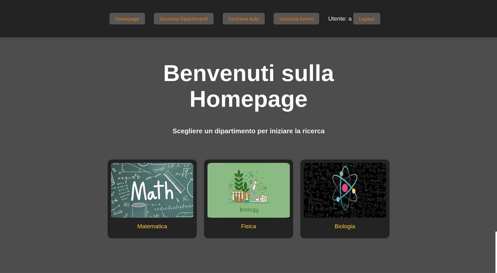
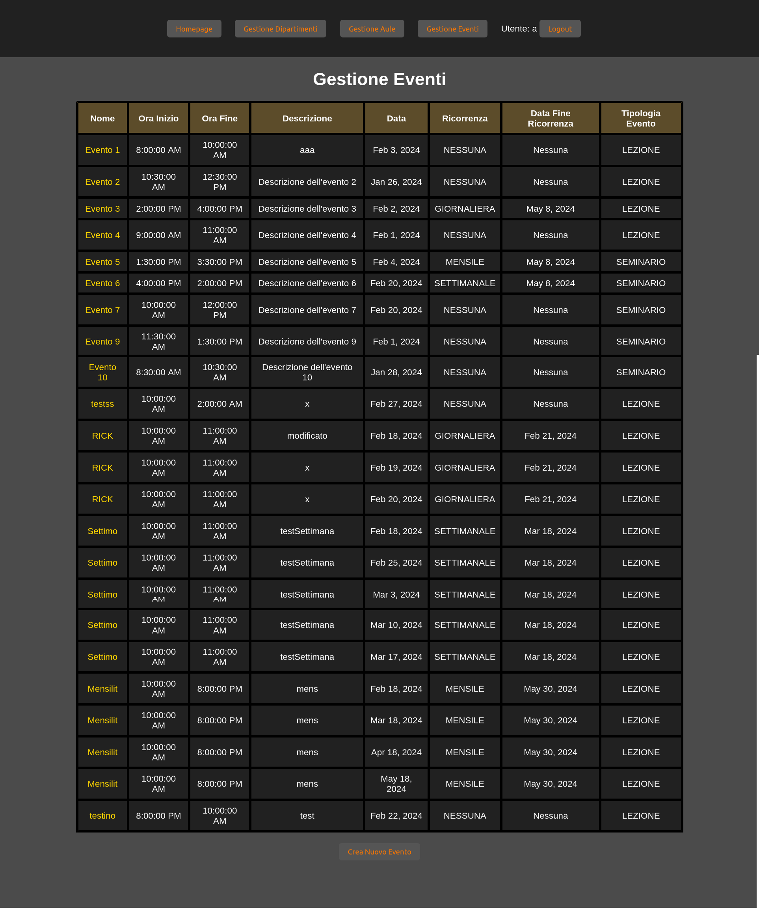

# Department Class Management System

This web application provides a comprehensive solution for managing classes across different departments. It's built using Java for the backend, with Maven as the build tool and MySQL as the database. The frontend is developed using Freemarker, JavaScript, HTML, and CSS.

## Features

- User authentication and authorization
- Department management
- Class scheduling and management
- Event tracking and organization
- Intuitive user interface

## Technologies Used

- Backend:
  - Java
  - Maven
  - MySQL
- Frontend:
  - Freemarker
  - JavaScript
  - HTML
  - CSS

## Screenshots

### Homepage

### Event Management Page

This page allows users to manage various events, including classes and seminars. Users can view event details such as name, time, description, recurrence, and event type.

The homepage welcomes users and provides quick access to different departments, allowing them to start their search or navigation.

